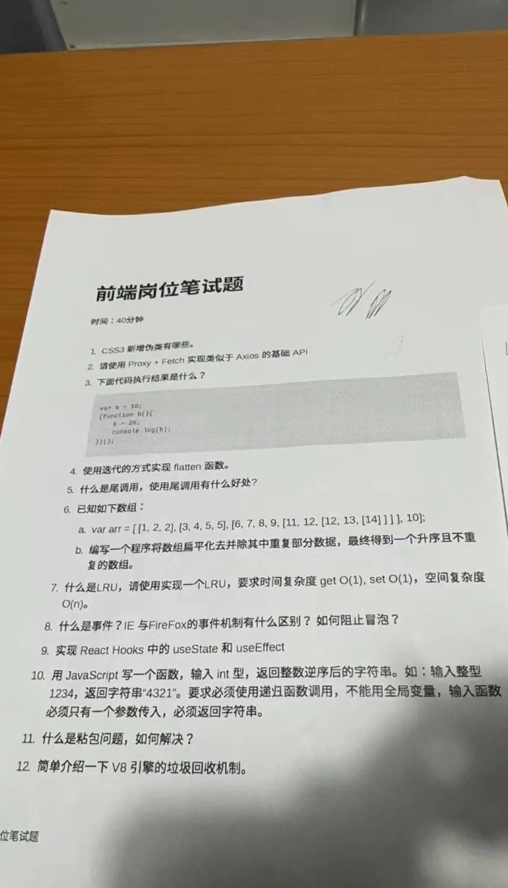

<!--
 * @Author: KiraZz1 1634149028@qq.com
 * @Date: 2023-04-14 09:48:58
 * @LastEditors: KiraZz1 1634149028@qq.com
 * @LastEditTime: 2023-04-14 09:57:19
 * @FilePath: /笔试题/20230414/README.md
 * @Description: 这是默认设置,请设置`customMade`, 打开koroFileHeader查看配置 进行设置: https://github.com/OBKoro1/koro1FileHeader/wiki/%E9%85%8D%E7%BD%AE
-->

# 20230414 - 群友传的面试题



怎么说呢，这份面试题感觉还是难了点，何况这公司才开了`7k`。我觉得这份题目给面试官答他都不一定回答得好。

代码题在文件夹中，此处仅记录问答题。

## 1.CSS3新增的伪类有哪些

1. `:nth-child(n)`：选择其父元素下的第 n 个子元素。

2. `:last-child`：选择其父元素下的最后一个子元素。

3. `:nth-of-type(n)`：选择其父元素下特定类型的第 n 个子元素。

4. `:last-of-type`：选择其父元素下特定类型的最后一个子元素。

5. `:first-child`：选择其父元素下的第一个子元素。

6. `:first-of-type`：选择其父元素下特定类型的第一个子元素。

7. `:empty`：选择没有任何子元素的元素。

8. `:not(selector)`：选择不匹配特定选择器的元素。

9. `:checked`：选择被选中的 input 元素。

10. `:enabled`：选择可用的 input 元素。

11. `:disabled`：选择禁用的 input 元素。

12. `:hover`：选择鼠标悬停在上面的元素。

13. `:focus`：选择获取焦点的元素。

14. `:active`：选择正在被操作的元素。

15. `:target`：选择当前活动的锚点目标。

16. `:nth-last-child(n)`：选择其父元素下倒数第 n 个子元素。

17. `:nth-last-of-type(n)`：选择其父元素下特定类型的倒数第 n 个子元素。

18. `:nth-of-type(odd/even)`：选择其父元素下特定类型的奇数或偶数子元素。

## 5.什么是尾调用，有什么好处

尾调用（`Tail Call`）是一种函数调用形式，指在一个函数的最后一个操作是调用另一个函数，并将其结果作为返回值返回。在尾调用的情况下，当前函数的调用帧可以被丢弃，从而避免了函数调用栈的增长，减少内存占用和提高性能。

尾调用有以下两个主要的好处：

1. 减少内存占用：在非尾调用的情况下，每个调用都会创建一个新的栈帧，因此调用栈可能会增长到非常大的程度，导致内存占用过高。而尾调用可以避免这种情况，因为它只会创建一个栈帧，并在调用完成后立即被丢弃。

2. 提高性能：由于尾调用只创建一个栈帧，并且没有其他操作，因此它可以提高函数的性能，减少额外的栈帧和其他的操作。

需要注意的是，尾调用只有在严格模式下才会进行优化，因为在非严格模式下，尾调用会修改调用栈，并且在某些情况下可能会产生副作用，因此不能进行优化。同时，只有在当前函数的返回值是尾调用函数的返回值的情况下，才能进行尾调用优化。如果当前函数还需要对尾调用函数的返回值进行操作，那么就不能进行尾调用优化。

总的来说，尾调用是一种可以提高函数性能和减少内存占用的优化技术，可以帮助开发者编写更高效和可维护的代码。

## 8.什么是事件，IE和Firefox的事件机制有什么区别？如何阻止冒泡？

事件（Event）是指在 Web 应用程序中发生的某些特定操作或状态的信号。例如，用户在页面上单击鼠标、按下键盘或滚动页面时，就会触发相应的事件。事件可以被捕获并处理，通常用于实现交互式和动态的 Web 页面。

IE 和 Firefox 的事件机制在一些方面存在差异。其中一些主要的区别包括：

1. 事件对象的属性和方法不同：IE 的事件对象和 Firefox 的事件对象具有不同的属性和方法，例如获取事件的目标元素、鼠标位置等信息的方式不同。

2. 事件传递顺序不同：IE 的事件传递顺序是冒泡型的，而 Firefox 的事件传递顺序是捕获型的。在冒泡型事件中，事件从最深层的元素开始传递，直到最外层的元素。在捕获型事件中，事件从最外层的元素开始传递，直到最深层的元素。

要阻止事件冒泡，可以使用事件对象的 `stopPropagation()` 方法。该方法可以阻止事件传递到父元素，并停止任何进一步的事件处理。例如：

```js
function handleClick(event) {
  event.stopPropagation();
  // 其他事件处理逻辑...
}
```

在这个示例中，`stopPropagation()` 方法将停止事件从当前元素向上冒泡，并阻止任何进一步的事件处理。需要注意的是，`stopPropagation()` 方法只能阻止事件冒泡，不能阻止事件的默认行为。如果需要阻止事件的默认行为，可以使用事件对象的 `preventDefault()` 方法。

## 11.什么是粘包问题，如何解决

在计算机网络中，粘包问题（`Packet Coalescing`）指的是发送方发送的多个小数据包被接收方合并成了一个大的数据包，或者接收方接收的一个大数据包被拆分成了多个小的数据包。这种情况下，接收方可能无法准确地识别每个数据包的边界，从而导致数据处理和解析错误。

粘包问题的出现原因有多种，例如网络传输的延迟、网络带宽的限制、缓冲区大小的限制等等。为了解决粘包问题，需要采取一些措施，例如：

1. 使用消息边界标识符：通过在消息的开始和结尾处加上特定的标识符，可以帮助接收方准确地识别每个消息的边界，从而避免粘包问题。例如，在基于 TCP 的网络通信中，可以使用特定的字符或字节序列作为消息边界标识符。

2. 使用固定长度消息：如果消息的长度是固定的，那么接收方可以根据固定的长度来准确地解析每个消息，从而避免粘包问题。

3. 使用分隔符：类似于消息边界标识符，使用特定的分隔符可以帮助接收方准确地识别每个消息的边界，从而避免粘包问题。例如，在`HTTP`协议中，使用回车换行符作为消息头和消息体之间的分隔符。

4. 使用消息长度前缀：在消息的开头加上消息的长度信息，接收方可以根据长度信息来准确地解析每个消息，从而避免粘包问题。

需要注意的是，在实际应用中，不同的通信协议和应用场景可能需要采用不同的方法来解决粘包问题。开发者需要根据实际情况进行选择和实现。

## 12.简单介绍下V8的垃圾回收机制

V8 引擎中的垃圾回收机制主要分为两个部分：标记清除和增量标记。标记清除是一种基础的垃圾回收算法，它会先遍历所有的` JavaScript `对象，并标记那些仍然被引用的对象。然后，它会清除那些没有被标记的对象，并回收它们占用的内存。

增量标记则是一种针对大型应用程序的优化技术。它将标记清除算法分成多个小步骤，这样可以让垃圾回收器与应用程序的执行交替进行，从而避免应用程序在进行垃圾回收时出现停顿的情况。

除了标记清除和增量标记之外，V8 引擎还使用了一些其他的垃圾回收技术来优化性能，例如分代回收和对象池等。其中分代回收是一种将`JavaScript`对象分成不同代的技术，每代对象有不同的回收策略，以便更好地适应对象的生命周期。对象池则是一种缓存机制，可以减少创建和销毁对象时的开销，从而提高应用程序的性能。

> 关于分代回收：
> 
> 分代回收将对象分为多个年龄段，对不同年龄段的对象采用不同的回收策略，可以提高垃圾回收的效率。
> 
> V8 引擎中将对象分为新生代（Young Generation）和老生代（Old Generation）两个部分，分别采用不同的回收策略：
> 
> 1. 新生代：新生代是存放生存时间较短的对象的区域。新生代对象主要通过 Scavenge 算法进行回收。Scavenge 算法将新生代空间分为两个区域：From 区域和 To 区域。当 From 区域被填满时，会触发垃圾回收，将 From 区域中的存活对象复制到 To 区域，并将 From 区域清空。同时，将 From 区域和 To 区域进行交换，使得 To 区域成为新的 From 区域。这个过程被称为 Scavenge，它可以快速地回收生存时间较短的对象，并且保证了空间的连续性。
> 
> 2. 老生代：老生代是存放生存时间较长的对象的区域。老生代对象主要通过标记清除（Mark-Sweep）和标记压缩（Mark-Compact）算法进行回收。当老生代空间快要被填满时，会触发垃圾回收。首先，使用标记清除算法标记并回收不再使用的对象，然后使用标记压缩算法对剩余的存活对象进行压缩，使得存活对象在内存中的位置连续，从而提高内存使用的效率。
> 
> 需要注意的是，V8 引擎中的分代回收策略是基于统计模型的，并不是绝对的。当一个对象存活时间较长时，它可能会从新生代被移到老生代中。同样，当一个对象在老生代中被标记为不再使用时，它可能会被移动到新生代中，并重新采用 Scavenge 算法进行回收。
